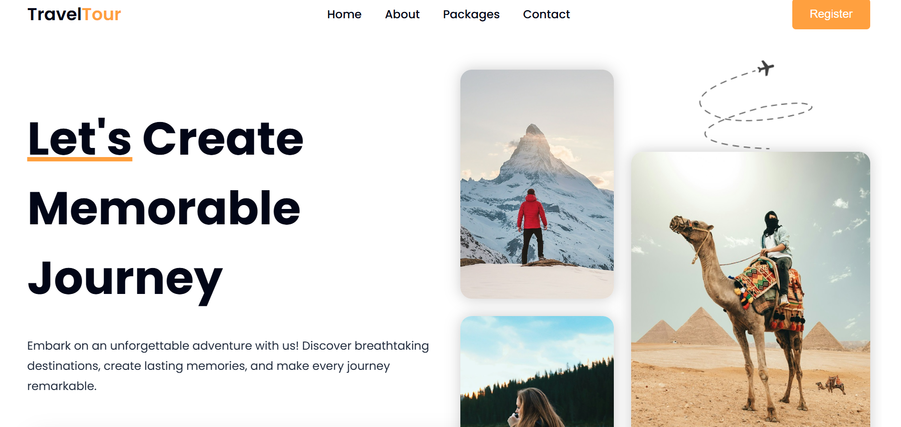

# 🌴 Travel Explore - Static Front-End Website

**Travel Explore** is a vibrant and visually captivating static front-end website designed to spark wanderlust and inspire global adventures 🌍. Built entirely using **HTML**, **CSS**, and **JavaScript**, this site showcases stunning travel destinations, immersive animations, and an intuitive layout perfect for travel agencies, bloggers, or explorers.

---

## 🧳 What’s Inside?

- 🏝️ Hero sections with immersive destination imagery
- 📸 Image galleries and featured travel spots
- 🧭 Navigation with smooth scrolling and animations
- 📅 Tour packages, travel tips, and call-to-action buttons
- 💬 Testimonials and contact form mockups
- 📱 Fully responsive for mobile & desktop

---

## ⚙️ Tech Stack

- **HTML5**
- **CSS3** (with Flexbox, Grid & transitions)
- **Vanilla JavaScript** (for interactivity & effects)

---

## ✨ Live Preview



---

## 🚀 How to Use

1. Clone this repository:
   ```bash
   git clone https://github.com/liyat-1/travel-explore.git
   ```
